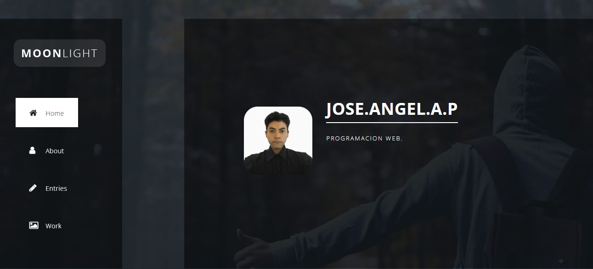
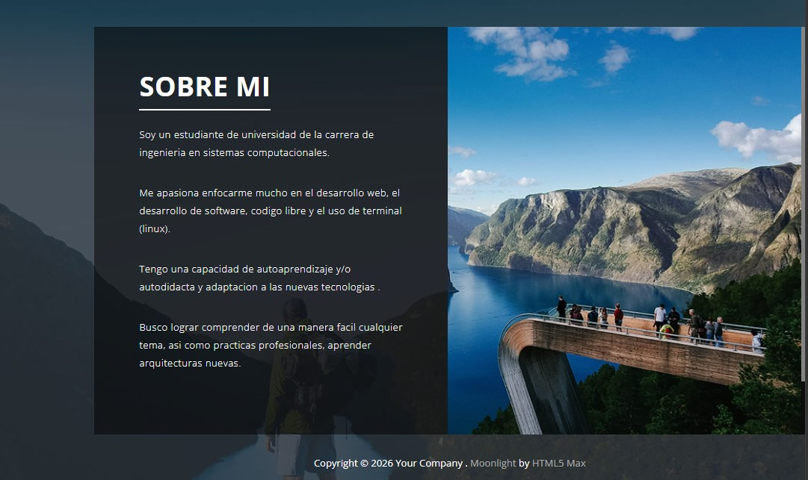
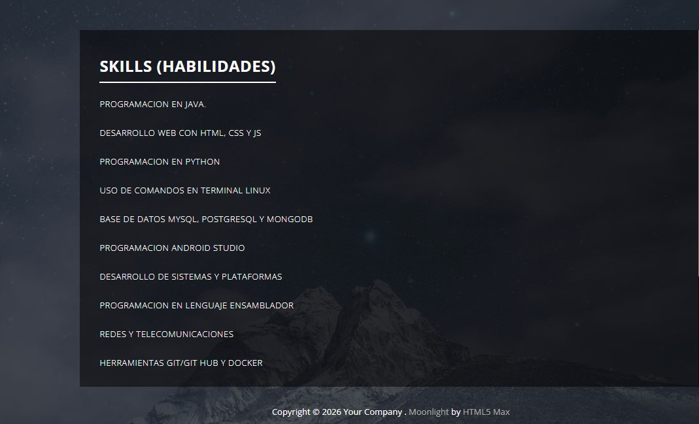
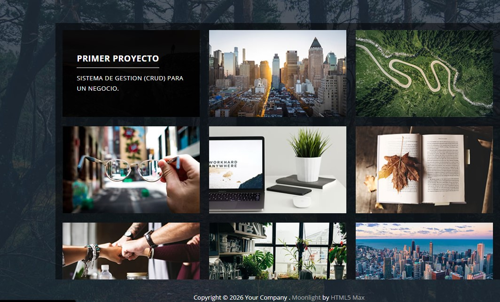

# Portada

Nombre del proyecto: Portafolio web con Bootstrap

## 📌 Descripción del Proyecto

En el proyecto que es un portafolio web personal desarrollado con html, css y js, incluye imagenes, con el propósito principal es presentar de forma clara y visual mi perfil académico, habilidades técnicas, proyectos desarrollados y mis aspiraciones profesionales dentro del área tecnológica.

- **Framework CSS utilizado:** Bootstrap[cite: 1]
- **Plantilla base:** Moonlight CSS Template
- **Enlace de descarga de la plantilla:** https://themewagon.com/themes/responsive-one-page-bootstrap-template-moonlight/

## Secciones del Portafolio

La plantilla original fue modificada para reestructurar sus secciones y adaptar la navegación a un enfoque de desarrollo:

1. **Home (Inicio):** Pantalla principal de bienvenida que da la primera impresión del portafolio.
2. **About (Sobre mí):** Presentación personal, estado académico actual en la carrera de Ingeniería en Sistemas 
3. **Skills (Habilidades):** *(Reemplaza la sección "Entries")* Clasificación de mis competencias técnicas, incluyendo tecnologías que manejo, herramientas que estoy aprendiendo actualmente y tecnologías futuras por dominar.
4. **Projects (Proyectos):** *(Reemplaza la sección "Work")* Galería y resumen de proyectos académicos y personales desarrollados.

> **Nota:** La sección original de **Contacto (Contact)** junto con su mapa interactivo y formulario fue eliminada para mantener un diseño más ágil y directo.

## 🛠️ Proceso de Creación Paso a Paso

A continuación se detalla el flujo de trabajo realizado para transformar la plantilla base en un portafolio personalizado:

### 1. Eliminación de la Pantalla de Carga (Preloader)
- Se removió el bloque contenedor `
` en el archivo `index.html` que incluía la animación SVG de carga.
- Se editó el archivo `js/main.js` eliminando el evento `$(window).load()` para evitar retrasos innecesarios al entrar a la página y lograr un acceso directo e instantáneo al contenido.
ya que esto tardaba demasiado en entrar a la pagina web 

### 2. Reestructuración del Menú de Navegación (`<nav>`)
- Se eliminaron los enlaces a secciones no utilizadas (como `#5` de contacto).
- Se renombraron las etiquetas visuales de la barra de navegación para alinearlas a la carrera: de *Entries* a **Skills** y de *Work* a **Projects**.

### 3. Redefinición de Contenidos y Secciones HTML
- **Sección About:** Redacción enfocada en el perfil
- **Sección Skills:** Habilidades actuales y futuras a desarrollar
- **Sección Projects:** Descripción de los proyectos desarrollados y futuras

### 4. Limpieza del Área Inferior
- Se eliminó completamente la sección `#5` que contenía el `<iframe>` de Google Maps y el formulario de contacto `<form>` para simplificar la estructura del código.

### 5. Despliegue en la Nube
- Configuración y subida del proyecto a GitHub.
- Activación de **GitHub Pages** desde las configuraciones del repositorio para publicar el sitio web de forma pública e interactiva.

---

## 📸 Capturas de Pantalla

*(Agrega aquí las capturas de tu portafolio funcionando en el navegador)*

---